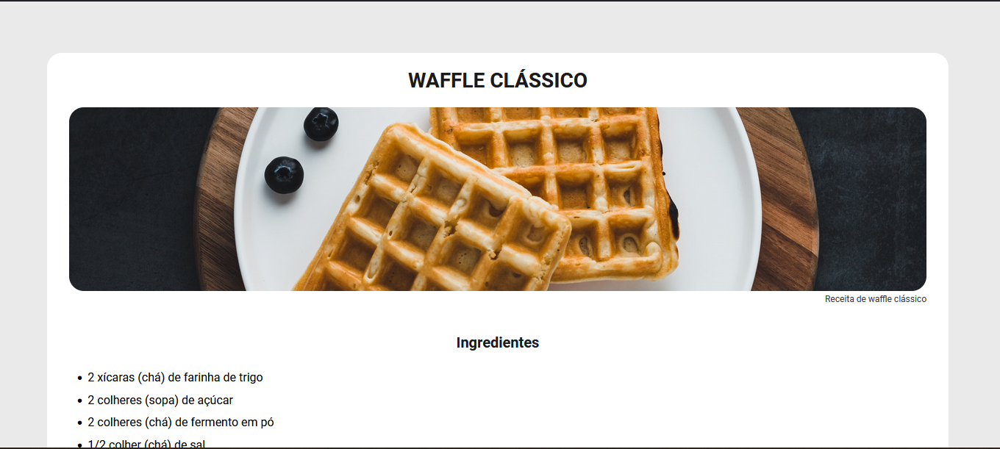

# Recipe Page

This is a solution to the [Rocketseat](https://www.rocketseat.com.br/) challenge - Recipe Page.  

## Table of contents

  - [Screenshot](#screenshot)
  - [Links](#links)
  - [Built with](#built-with)
  - [Author](#author)

### Screenshot

### Links

- Solution URL: (https://github.com/fabifelicia/desafio-receita-rocketseat)
- Live Site URL: (https://desafio-receita-rocketseat.vercel.app/)

### Built with

- Semantic HTML5 markup
- CSS custom properties

## Author

[ Fabiana Barreto](https://github.com/fabifelicia)
- Fabiana Barreto - [@fabifelicia](https://github.com/fabifelicia)

